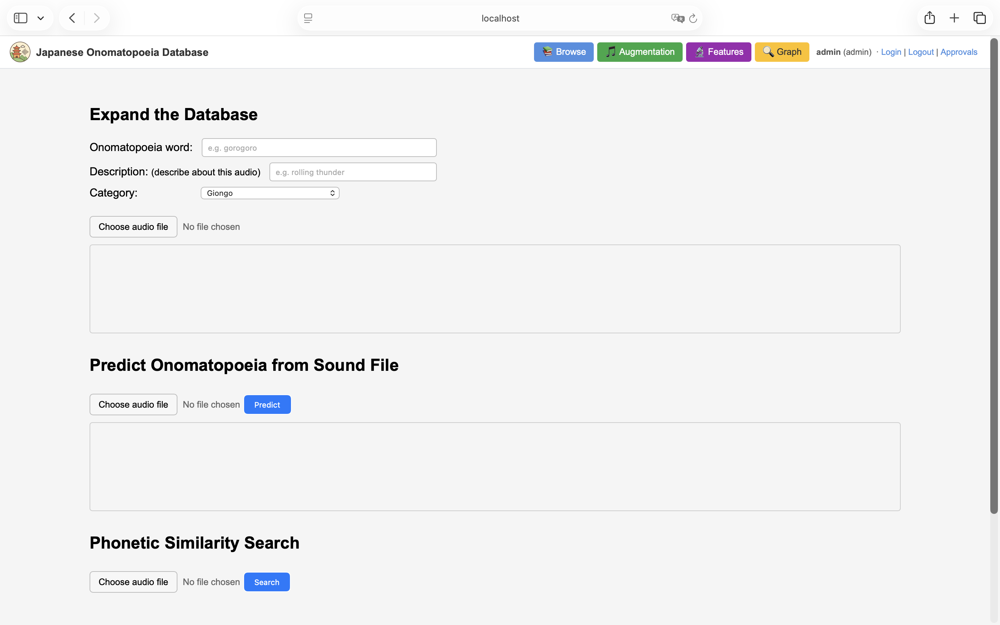
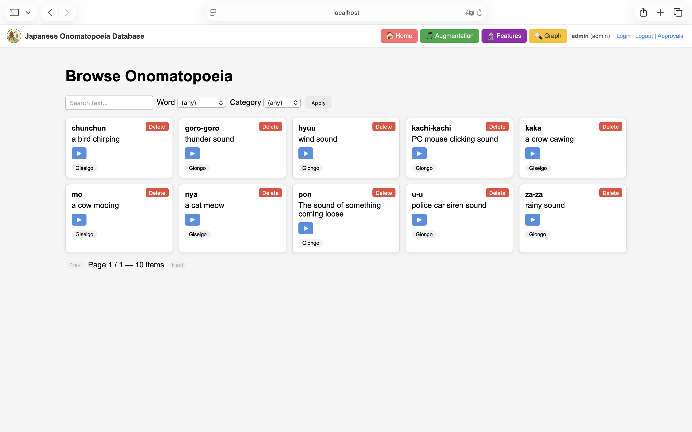
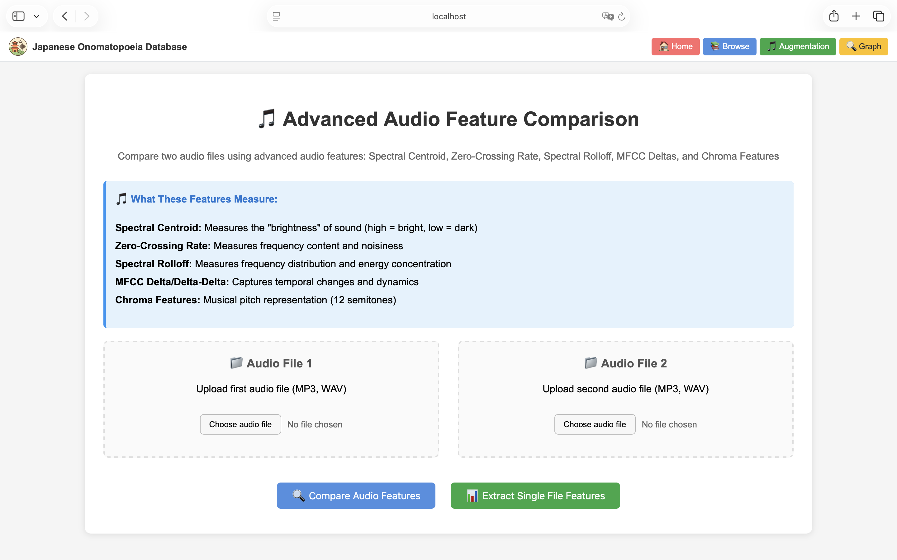
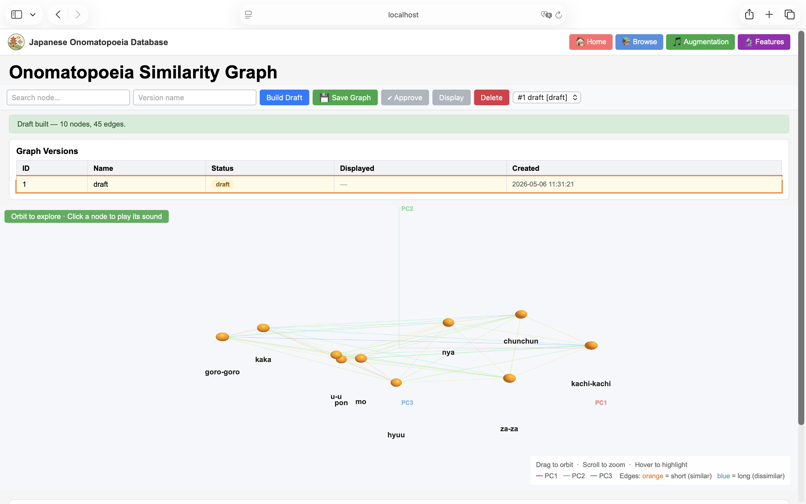
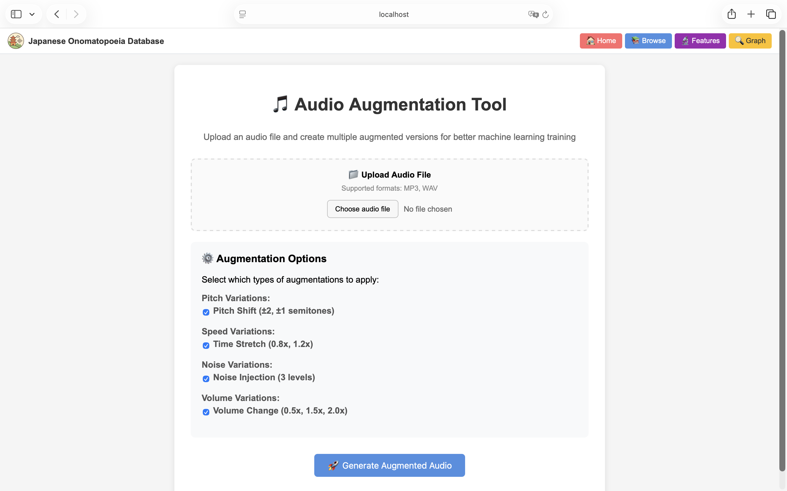

# User Documentation

This documentation describes the user interface of the web application called the Japanese Onomatopoeia Database. We focus only on Giongo (environmental sounds/noises) and Giseigo (human/animal sounds), since the goal is to map from an audio file to onomatopoeic words.

## System Overview and Access Permissions
This system defines multiple user types. Depending on the user type, accessible pages and functions are restricted. The user types are as follows:
* Basic (basic user): can browse the onomatopoeic-word dataset, predict onomatopoeic words from audio, and use voice-based similarity search.
* Researcher: in addition to the basic functions, can use comparative analysis of acoustic characteristics and network visualization of similarity relationships. Researcher accounts must be approved by an Admin.
* Admin (administrator): can use all functions; in addition, can register new audio data, train the model, approve researcher accounts, and build and save similarity graphs.

## Basic Account Operations and Authentication Flow
Users log in by entering a username and password on the login page. New users who would like to request Researcher privileges enter the required information on the registration page. After registration, the account remains pending and access to the system is limited until an Admin approves the account.

## Key Features

### Main Dashboard (Home)
This page is available for every user type.
The main dashboard offers the following functions.
* **Onomatopoeic word prediction from an audio file (Predict)** 
  We choose an audio file (`.wav` or `.mp3`). After uploading the file, the waveform is visualized using `WaveSurfer.js`. Then we run Predict, and the predicted onomatopoeic word from the machine learning model is shown.

* **Voice-based similarity search (Phonetic Search)** 
  Once we run Search based on MFCC features, the top three onomatopoeic words with the most similar acoustic characteristics are listed.

* **Database extension and annotation (Admin only)** 
  Admin users can add a new audio file to the dataset with its category (Giongo or Giseigo), onomatopoeic word (label), and description.

* **Train model (Admin only)**
  Admin users can train or retrain the prediction model using the stored audio data. The dataset must include at least five audio files and at least two different onomatopoeic words (labels) to train the model.

(User type: Admin)
### Browse Database
This page is available for every user type.
Users can browse onomatopoeic words with audio and filter them using several conditions. Users can filter entries by search text and category, and play the corresponding audio clip using the play button on each item. Admin users can delete items using the delete button.

(User type: Admin)
### Feature Comparison Page
This page is available only for **Researcher** and **Admin** types.
It provides a quantitative analysis of the acoustic similarity between two environmental sounds. By extracting multiple acoustic features such as MFCC, spectral centroid, and zero-crossing rate, the system calculates a similarity score and the contribution of each feature.
To use this function, we upload two audio files (Audio File 1 and Audio File 2), then click `Compare Audio Features`. The system visualizes the overall similarity score and the similarity by feature. We can also extract features from a single audio file by uploading a file and clicking `Extract Single File Features`.

(User type: Admin)
### Similarity Explorer Page
This page is available only for **Researcher** and **Admin** types.
It visualizes audio distances between onomatopoeic words as a 3D network graph, where nodes represent onomatopoeic words and edges represent the distance (similarity) between two nodes.  
When we click a node, the system plays the audio corresponding to that onomatopoeic word.  
This function projects multidimensional acoustic feature vectors into a 3-dimensional space using principal component analysis (PCA).  
The panel below the graph shows the axis labels, variance, and an interpretation of the principal components as follows.
* The first principal component (PC1) is mainly driven by brightness and noisiness (spectral scalars), and secondarily by timbre (MFCC).  
* The second principal component (PC2) is similar to PC1, representing its remaining variation.
* The third principal component (PC3) is mainly driven by timbre (MFCC), and secondarily by brightness and noisiness (spectral scalars).  
  
The proportions of PC1-PC3 change dynamically depending on the dataset.
Only Researcher and Admin users can visit this page, view the graph, rotate it, zoom in/out, and search for nodes. Admin users can build, save, and approve a new (draft) graph, choose which graph is displayed to Researchers, and delete graph versions.

(User type: Admin)
### Audio Augmentation Page
This page is available only for **Admin** type.
It allows to enlarge the training data for the machine learning model. From a single audio file, it automatically generates multiple augmented versions. The workflow is as follows.
We upload an audio file and choose augmentation methods (Pitch Shift, Time Stretch, Noise Injection, Volume Change) using checkboxes. Then we can play and review the generated audio files. If needed, they can be downloaded locally.

(User type: Admin)
## User Usage Scenario
We suppose that the main target users are Japanese language learners (basic users). Therefore, we describe a possible usage scenario step by step as follows:
* **Step 1: Record the Sound**  
  Users record an environmental or animal sound that caught their attention.
* **Step 2: Predict Onomatopoeic Word** 
  Users access the home page, see userdoc-home, and then use the Predict function by uploading the recorded audio file. The trained model then analyzes its acoustic features and suggests the onomatopoeic word that seems to fit best.
* **Step 3: Expand the options with Phonetic Similarity Search** 
  If they want to know similar sounds despite the predicted result, they use Similarity Search, since this search shows onomatopoeic words that have acoustic features similar to the recorded audio.
* **Step 4: Check the meaning of the onomatopoeic word on the browse page** 
  Users go to the browse page, see userdoc-browse, to check the descriptions or play the sounds of onomatopoeic words found on the home page.

## Sample Audio Dataset
If you want to try to use some functions with audio, a sample annotated audio dataset is available in `/sample_audio_dataset`.